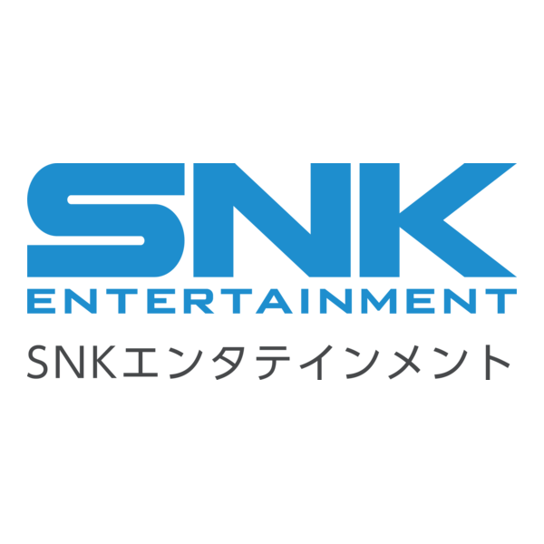
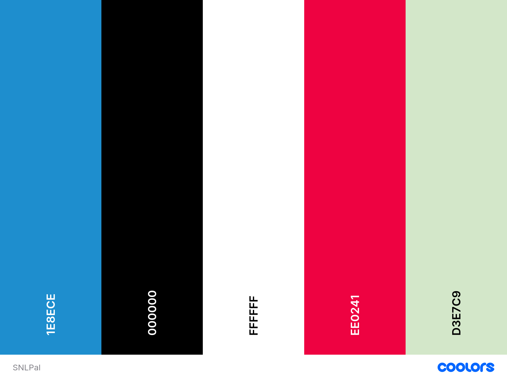
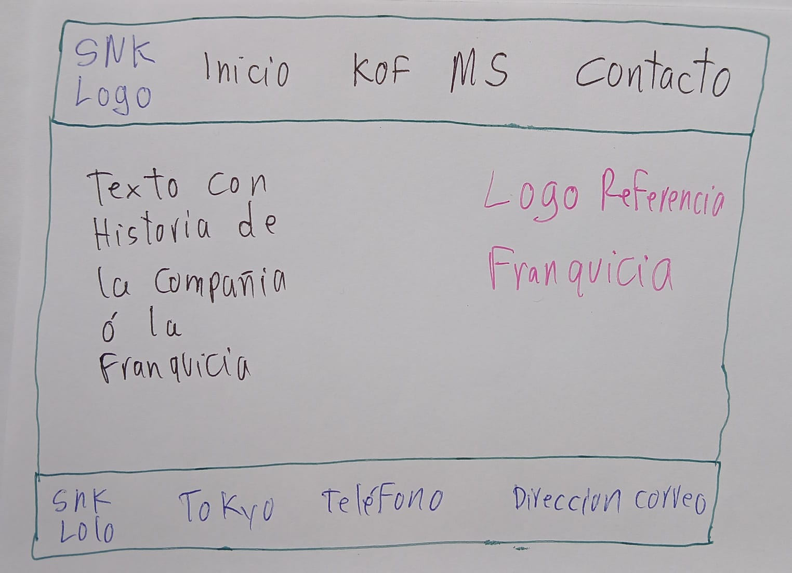
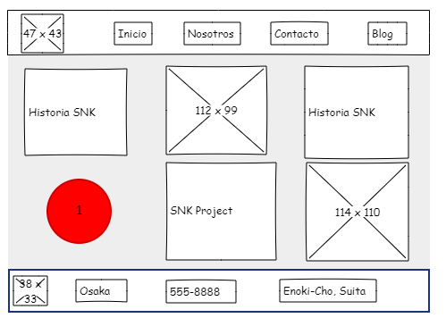

# Proyecto final / SNK Project
 

## Investigación

### Público objetivo
La página estará dirigida principalmente a personas interesadas en la historia de los videojuegos, especialmente quienes conocen o desean conocer el legado de SNK y sus franquicias más representativas. El enfoque principal será para jugadores entre 18 y 35 años, aunque también se considera un público nostálgico de 35 a 45 años que vivió la época de los arcades y de Neo Geo. Además, el contenido puede atraer a estudiantes, coleccionistas y fanáticos de la cultura gamer japonesa. SNK y Neo Geo están fuertemente asociados a los juegos de pelea y a la historia de los arcades, por lo que ese perfil encaja con la temática del sitio. 

### Datos demográficos estimados
- **Edad principal:** 18 a 35 años.
- **Edad secundaria:** 35 a 45 años.
- **Intereses:** videojuegos retro, juegos de pelea, cultura arcade, historia de consolas y estética japonesa.
- **Nivel de experiencia:** desde jugadores casuales hasta fanáticos expertos de SNK.
- **Comportamiento digital:** consumen contenido en redes sociales, videos, reseñas, blogs y sitios especializados sobre videojuegos. 

### Pregunta de investigación
1. ¿Qué elementos históricos permiten representar de manera atractiva la trayectoria de SNK y sus franquicias principales en una página web?

### Racional creativo
La propuesta creativa busca recrear la identidad de SNK mediante la energía de los juegos de pelea. El sitio presentará la historia de la empresa de forma clara y directa, junto con una sección dedicada a sus franquicias más importantes. La intención es combinar nostalgia, información histórica y orden visual para generar una experiencia atractiva tanto para fanáticos de larga data como para usuarios que se acerquen por primera vez a la marca.

## Guía de estilo y diseño (Design System)

### 1. Paleta de color
Usaré una base de tonos basados en la marca y el estilo de la empresa, como: 
- Azul   (#1e8ece)
- Negro  (#000000)
- Blanco (#ffffff) 
- Rojo   (#ee0241) 
- Menta  (#d3e7c9)

 

### 2. Tipografía
La tipografía principal es Roboto Serif ya que es fuerte, moderna y fácil de reconocer para títulos y el texto corrido. Tambien es una fuente limpia y legible que facilita la lectura en pantallas pequeñas y grandes.

### 3. Elementos visuales
Se incluirán imágenes de logos y material gráfico de las franquicias más conocidas. Siempre con un enfoque minimalista.

### 4. Distribución del contenido
La información se organizará en bloques claros: historia de SNK y franquicias principales. Esta estructura mejora la navegación y permite que el usuario encuentre rápidamente lo que busca. Manteniendo ese enfoque minimalista.

### 5. Accesibilidad WCAG AA
Se usan contrastes adecuados en los colores y el tamaño de la letra adecuado para personas con problemas visuales para que tenga una visiblidad y funcionalidad adecuadas.  

## Instrucciones Del Proyecto

### Descarga del Documento de Evalaucion:
👉 [Descargar Documento de Evaluacion](./Guillermo_Instrucciones_Rubrica-Evaluacion_Actividad_ComprobaciónFinal_Mod_D.I.W_2026.docx) 

Despues de darle click al enlace, tiene que darle click a View Raw para poder descargar el documento. 

### Boceto
Este es el boceto a mano del proyecto

### Mockup
Hecho en Pencil
👉 [Descargar Mockup](./SNKPencil.epgz) 

Despues de darle click al enlace, tiene que darle click a View Raw para poder descargar el archivo. 

### Penpot
Enlace al proyecto en Penpot.

[Enlace a Penpot](https://design.penpot.app/#/view?file-id=a234c67f-eb39-8116-8008-3f8e22a95d8d&page-id=86bdcaa1-299a-806a-8008-2057aec49c8a&section=interactions&index=0&share-id=8f0a304d-16ec-81f8-8008-406880723d51)

### Figma
Prototipo Móvil
[Enlace a Prototipo Móvil](https://www.figma.com/proto/eUJ9ATCOh1qj9HH4blC4rD/ScrollKOF?node-id=1-12&starting-point-node-id=1%3A12)

# Correcciones 

### Wireframe
Wireframe refleja boceto de interfaz         (No existe wireframe) **Hecho**  

Wireframe cumpre requerimientos y normativa  (No existe wireframe) **Hecho**  

Wirefreame Agregado  
 

### Componentes
Anotaciones sobre elementos importantes (🚨Uso de componentes) **Hecho**  
Se crean los componentes de Telefono y Ciudad para los Footers.

### Version Movil
Visualizacion perfecta en resolucion movil  (🚨No hay relación entre versión escritorio y móvil)

### Logotipo
Convenciones universales presentes (🚨Enlace en logotipo a inicio) **Hecho**

### Iconos
Iconos relacionados a contenidos (🚨Escasa iconografía) **Hecho**  
Se agregan los iconos de Inicio, Telefono, Email y Ciudad.

### Jerarquia en Texto
Evidencia jerarquia en texto (🚨Textos en menú y footer más grandes que párrafos) **Hecho**  
Se modifican los textos de los headers y footers, los mismos se pasan a letra tamaño 26  
y se agregan Titulos en H1 en tamaño 36 los mismos se cambian a color #1e8ece,  
color que es el mismo del logo de la empresa. 

### Enlace de Penpot

[Enlace a Penpot Corredigo](https://design.penpot.app/?_gl=1*k9c7s1*_gcl_au*NDY4NjUxMjUzLjE3ODA1MjA0MjQ.*_ga*MTYyNDcxMTcyOS4xNzgwNTIwNDIy*_ga_K0KF97C51Q*czE3ODI5MjQ5NjQkbzE1JGcwJHQxNzgyOTI0OTY2JGo1OCRsMCRoMA..#/workspace?team-id=8580c946-af19-8023-8008-1c76200a5430&file-id=a234c67f-eb39-8116-8008-3f8e22a95d8d&page-id=86bdcaa1-299a-806a-8008-2057aec49c8a&board-id=26703ad8-cab6-8059-8008-205ff243f58a)

### Descarga de la Rubrica de Evaluacion Corregida
En este enlace se puede descargar la rubrica evaluada por el profesor  
con las sugerencias a corregir por parte del profesor:
[Enlace para descargar la rubrica](./GuillermoRevisado_Instrucciones_Rubrica-Evaluacion_Actividad_Comprobaci%C3%B3nFinal_Mod_D.I.W_2026.docx)

# :;

